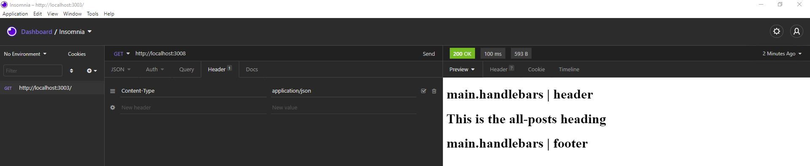

## Your Task

A simple Google search for any concept covered in this course returns thousands of think pieces and tutorials from developers of all skill levels!

Build a CMS-style blog site similar to a Wordpress site, where developers can publish their blog posts and comment on other developers’ posts as well. You’ll build this site completely from scratch and deploy it to Heroku. Your app will follow the MVC paradigm in its architectural structure, using Handlebars.js as the templating language, Sequelize as the ORM, and the express-session npm package for authentication.

## User Story

```md
AS A developer who writes about tech
I WANT a CMS-style blog site
SO THAT I can publish articles, blog posts, and my thoughts and opinions
```

## Screenshot of Insomnia App

Shown below
* 

## Review

You are required to submit BOTH of the following for review:

* The URL of the functional, deployed application.https://techblogger90210.herokuapp.com/

* The URL of the GitHub repository, with a unique name and a readme describing the project. (https://github.com/Jasonrosasramirez/blogOfTech)

---

© 2021 Trilogy Education Services, LLC, a 2U, Inc. brand. Confidential and Proprietary. All Rights Reserved.